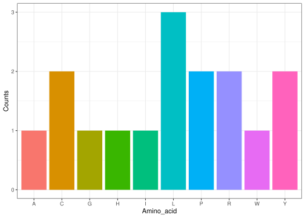

dogmar: A guide
================
s253700, s253704, s253699, s253694, s253696

<!-- README.md is generated from README.Rmd. Please edit that file -->

<div style="text-align: center;">

# DogmaR User guide

</div>

**GitHub Repository:**
[dogmar](https://github.com/rforbiodatascience25/group_04_package)

**Package description** It is a package that allows you to translate a
randomly generated DNA sequence into proteins. It also allows you to
perform a brief analysis of protein composition.

``` r
library(dogmar)
```

<div style="text-align: center;">

## Functions

</div>

### create_dna(length)

This function creates a random DNA sequence of a specific length
determined by the parameter “length” Argument:

- length: An integer that represents the length of the output random DNA
  sequence

``` r
dna <- create_dna(50)
print(paste0("The randomly generated DNA sequence is: ", dna))
#> [1] "The randomly generated DNA sequence is: TGCCATCCTTTGTACCGCTACCTAGCCCCCGGATGGAGAATTTGTTTAAA"
print(paste0("The length of the DNA sequence is: ", nchar(dna)))
#> [1] "The length of the DNA sequence is: 50"
```

### to_rna(dna)

This function takes a DNA sequence as input and converts it into the
corresponding RNA sequence by replacing all occurrences of thymine (“T”)
with uracil (“U”). Argument:

- dna:A character string representing a DNA sequence (e.g., “ATGC”)

``` r
rna <- to_rna(dna)
print(paste0("The DNA sequence is: ", dna))
#> [1] "The DNA sequence is: TGCCATCCTTTGTACCGCTACCTAGCCCCCGGATGGAGAATTTGTTTAAA"
print(paste0("The RNA sequence is: ", rna))
#> [1] "The RNA sequence is: UGCCAUCCUUUGUACCGCUACCUAGCCCCCGGAUGGAGAAUUUGUUUAAA"
```

### split_codons(rna, start)

This function takes a RNA sequence as input and converts it into a
character vector where each component is a codon of 3 bases. Argument:

- rna:A character string representing a RNA sequence (e.g., “AUGC”)
- start: An integer (1-3) that specifies the starting position for the
  reading frame within the RNA sequence

``` r
codons <- split_codons(rna, start=1)
print(paste0("The RNA sequence is: ", rna))
#> [1] "The RNA sequence is: UGCCAUCCUUUGUACCGCUACCUAGCCCCCGGAUGGAGAAUUUGUUUAAA"
print(paste0("The codons are:  ", codons))
#>  [1] "The codons are:  UGC" "The codons are:  CAU" "The codons are:  CCU"
#>  [4] "The codons are:  UUG" "The codons are:  UAC" "The codons are:  CGC"
#>  [7] "The codons are:  UAC" "The codons are:  CUA" "The codons are:  GCC"
#> [10] "The codons are:  CCC" "The codons are:  GGA" "The codons are:  UGG"
#> [13] "The codons are:  AGA" "The codons are:  AUU" "The codons are:  UGU"
#> [16] "The codons are:  UUA"
```

### to_protein()

This function takes the triplets sequences of RNA (codons) and translate
them into its protein sequence. Argument:

- codons: A character string representing a the codon sequences (e.g.,
  “ATG”, “UGG”, “AUG”)

``` r
protein <- to_protein(codons)
print(paste0("The RNA sequence is: ", rna))
#> [1] "The RNA sequence is: UGCCAUCCUUUGUACCGCUACCUAGCCCCCGGAUGGAGAAUUUGUUUAAA"
print(paste0("The codons are:  ", codons))
#>  [1] "The codons are:  UGC" "The codons are:  CAU" "The codons are:  CCU"
#>  [4] "The codons are:  UUG" "The codons are:  UAC" "The codons are:  CGC"
#>  [7] "The codons are:  UAC" "The codons are:  CUA" "The codons are:  GCC"
#> [10] "The codons are:  CCC" "The codons are:  GGA" "The codons are:  UGG"
#> [13] "The codons are:  AGA" "The codons are:  AUU" "The codons are:  UGU"
#> [16] "The codons are:  UUA"
print(paste0("The protein sequence is: ", protein))
#> [1] "The protein sequence is: CHPLYRYLAPGWRICL"
```

### aa_count(protein)

This function considers an amino acid sequence (as a character string),
counts how many times each unique amino acid occurs, and then returns a
ggplot2 bar chart showing the counts. The code plots a coloured bar
chart showing how many times each amino acid appears in the input
sequence.

Argument:

- protein: A string of characters representing the protein sequence

``` r
aa_count(protein)
```


